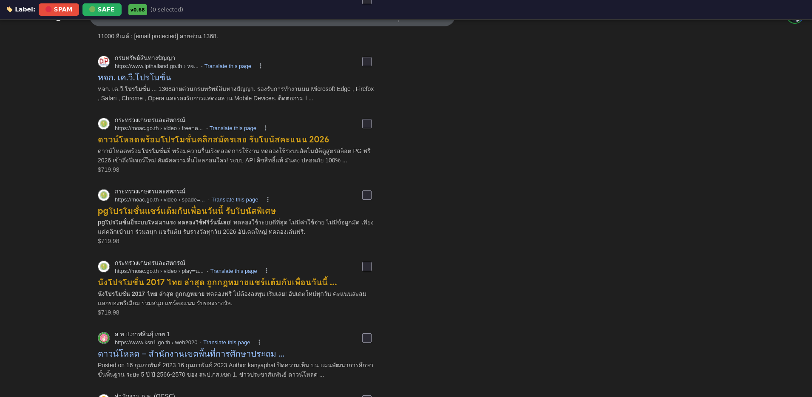

# Spam Detection Tokenizer

Terminal application for detecting spam/casino content using ML-based text classification with GPT-4o tokenization and keyword intent extraction.

## Features

- **GPT-4o Tokenizer** — Uses `o200k_base` (tiktoken-rs) for accurate token counting
- **Bernoulli Naive Bayes** — Trigram + quadgram vectorizer with Lidstone smoothing (α=0.1)
- **Keyword Intent Extraction** — RAKE-based Thai keyword extraction with intent classification (keyword-intents.md spec)
- **Prefix Keyword Technique** — Extracts first word as primary intent, sub-tokenized via tiktoken
- **Intent Categories** — Navigational, Commercial, Transactional, Informational, Unknown
- **Keyword Weighting** — Manual boost for high-signal spam keywords
- **Hard Rules** — Currency symbol and spam link detection
- **Model Persistence** — Trained model saved to `model.bin`, reused across runs
- **TUI** — Real-time ratatui interface with token analysis and ML prediction
- **Firefox Extension** — Collect real-world training data from Google search results

## Quick Start

```bash
# Build
cargo build --release

# Setup training data from examples
chmod +x setup_data.sh retrain.sh
./setup_data.sh

# Run TUI application
cargo run --release
```

### Controls

| Key | Action |
|-----|--------|
| Type | Enter text in input field |
| Enter | Analyze text |
| Esc | Cancel input |
| q | Quit |

## Project Structure

```
spam-intent-labeler/
├── src/
│   ├── main.rs              # TUI application
│   ├── keyword_intent.rs     # Keyword intent extraction module
│   └── bin/
│       ├── eval.rs           # Evaluate model against raw data
│       ├── export_model.rs   # Export model for Firefox extension
│       ├── keyword_intent_test.rs  # Test keyword intent extraction
│       └── generate_report.rs      # Generate keyword intent report
├── tests/                    # Generated reports (not tracked)
│   └── keyword-intent-report.md
├── extension/
│   ├── manifest.json         # Firefox extension manifest
│   ├── background.js         # Background script (persistent model)
│   └── content.js            # Content script (UI + highlighting)
├── data/
│   ├── spam.example.txt      # Example spam samples (for setup)
│   ├── safe.example.txt      # Example safe samples (for setup)
│   ├── spam.txt              # [PRIVATE] Your spam training data
│   ├── safe.txt              # [PRIVATE] Your safe training data
│   └── raw/                  # [PRIVATE] Collected data from extension
├── retrain.sh                # Retrain and update extension model
├── setup_data.sh             # Initialize training data from examples
├── keyword-intents.md        # Keyword intent extraction spec
├── model.bin                 # [PRIVATE] Trained model (binary)
└── model_version.txt         # [PRIVATE] Version counter
```

## Training Pipeline

### 1. Collect Data via Firefox Extension

1. Open Firefox → `about:debugging` → **This Firefox** → **Load Temporary Add-on**
2. Select `extension/manifest.json`
3. Browse Google Search — results are auto-scanned
4. Click **🔴 SPAM** or **🟢 SAFE** to download labeled data to `~/Downloads/`

### 2. Merge Raw Data

```bash
# Move downloaded files to data/raw/
mv ~/Downloads/spam.*.txt data/raw/
mv ~/Downloads/safe.*.txt data/raw/
```

> **Note:** `data/raw/`, `data/spam.txt`, and `data/safe.txt` are not tracked in git.
> Use `./setup_data.sh` to create them from examples for initial development.

### 3. Retrain

```bash
./retrain.sh
```

This merges raw data, deduplicates, trains the model, evaluates accuracy, and updates `extension/model.json.gz`.

### 4. Reload Extension

Open `about:debugging` → find "Spam Labeler" → click **Reload**.

## Model Architecture

| Component | Value |
|-----------|-------|
| **Tokenizer** | o200k_base (GPT-4o) |
| **Classifier** | Bernoulli Naive Bayes |
| **Features** | Tokens + Trigrams + Quadgrams |
| **Smoothing** | Lidstone α=0.1 |
| **Hard Rules** | Currency symbols ($€£฿), Spam links (line.me, @line) |
| **Keyword Boost** | +5.0 per high-signal word |

### High-Signal Keywords

Thai casino/scam keywords: `สล็อต`, `แตกง่าย`, `บาคาร่า`, `วอเลท`, `wallet`, `เว็บตรง`, `ไม่ผ่านเอเย่นต์`, `เครดิตฟรี`, `ฝาก15รับ100`, `pg slot`, `pgslot`, `joker slot`, `jackpot`, `cashback`, `คืนยอดเสีย`, etc.

## Versioning

Model versions follow the format **`v0.{N}`** where `N = sample_count / 10`:

| Samples | Version | Meaning |
|---------|---------|---------|
| 100 | v0.10 | Initial training |
| 458 | v0.45 | Current |
| 1000 | v0.100 | 1K samples |
| 2500 | v0.250 | 2.5K samples |

Each time you run `./retrain.sh`, the version increments based on the total number of training samples. This makes it easy to track model quality — higher versions mean more training data.

## Evaluation

```bash
cargo run --release --bin eval
```

Tests the model against all files in `data/raw/` and reports accuracy.

## Keyword Intent Extraction

Extract structured intent data from spam text using the [keyword-intents.md](keyword-intents.md) spec.

### Run Tests

```bash
cargo run --release --bin keyword_intent_test
```

Outputs per-sample analysis showing prefix keywords, sub-tokens, intent classification, and extracted keywords with scores.

### Generate Report

```bash
cargo run --release --bin generate_report
```

Generates a full Markdown report at `tests/keyword-intent-report.md` with:
- Intent distribution summary
- Per-sample breakdown (prefix keyword, sub-tokens, intent, keywords)
- Sample JSON output matching the spec schema
- Performance metrics

### Intent Categories

| Intent | Description | Example Keywords |
|--------|-------------|-----------------|
| **Navigational** | Looking for specific brands | `888`, `joker`, `jili`, `slot`, `ufa`, `bet` |
| **Commercial** | Promotions, freebies, bonuses | `ฟรี`, `โบนัส`, `โปรโมชั่น`, `เครดิตฟรี` |
| **Transactional** | Ready to register/deposit | `สมัคร`, `ลงทะเบียน`, `ฝาก`, `สมาชิก`, `vip` |
| **Informational** | How-to, rules, guides | `วิธี`, `แนะนำ`, `ทดลอง`, `กติกา` |
| **Unknown** | No clear intent match | — |

### Extraction Techniques

1. **Prefix Keyword Extraction** — Gets the first word (before space) as the primary intent keyword. If mixed Thai/English (e.g., `888NEO`), extracts the dominant prefix portion.
2. **Tiktoken Sub-tokenization** — Uses `o200k_base` BPE to split compound prefixes (e.g., `888NEO` → `888`, `neo`).
3. **Intent Dictionary Scanning** — RAKE-style keyword extraction by scanning body text against a curated intent dictionary.

### Example Output

```json
{
  "primary_intent": "Navigational",
  "confidence_score": 0.80,
  "extracted_keywords": [
    { "word": "888neo", "score": 1.00 },
    { "word": "888", "score": 0.80 },
    { "word": "neo", "score": 0.80 },
    { "word": "slot", "score": 0.20 },
    { "word": "jili", "score": 0.20 }
  ],
  "metadata": {
    "language": "th",
    "processor": "rake-rs-v1"
  }
}
```

## Extension

### Spam Highlighting

The extension scans Google search results and highlights spam titles in **yellow** (`#d4a017`).



Each result gets a checkbox on the right side. The model runs locally in the background — no data leaves your machine.

### Collect Training Data

The toolbar provides **🔴 SPAM** and **🟢 SAFE** buttons to label search results and download them as training files.

See [extension/README.md](extension/README.md) for the full training workflow.

### Installation

1. Firefox → `about:config` → set `xpinstall.signatures.required` = `false`
2. `about:debugging` → **This Firefox** → **Load Temporary Add-on**
3. Select `extension/manifest.json`

The extension runs a background script that keeps the model in memory across page reloads. Each search result's h3 title turns **yellow** if detected as spam.
